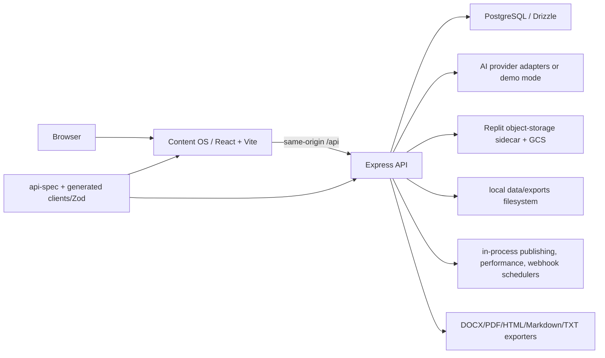

# Post-Recovery Production Readiness Audit

**Audit date:** 2026-08-12

**Repository:** `ebyron357/agency-content-grants`

**Verified starting `main`:** `6eeead8ec49a04eb788597b75c1e6f326339608e`

**Audit branch:** `audit/post-recovery-production-readiness`

**Decision:** **NO-GO for production deployment**

## Executive verdict

The recovery sequence is complete and the recovered monorepo is internally coherent enough for controlled engineering work. The frozen install, typecheck, 249 API tests, 10 Content OS tests, two migration replays, production build, and API health check all pass. GitHub Actions run `31628469891` also passed the 38-check recovery integration suite at the final review-fix commit.

The product is not production-ready. The current application is a Stage 0, Replit-oriented recovery baseline with a shared team password, no tenant or role isolation, Replit-specific object storage, local-filesystem exports, in-process background work, no production routing/deployment definition, no usable media workflow, no citation rendering, and material editor/authorization defects. A clean browser launch renders the login UI, but its same-origin `/api` assumption has no repository-defined local or non-Replit reverse proxy, so the end-to-end UI journey is blocked at authentication outside the recovered hosting context.

This audit authorizes no deployment or feature implementation. It converts the evidence into a production closeout backlog and decision gates.

## Verified GitHub baseline

GitHub was queried directly before local work.

| Check | Live result |
|---|---|
| PR #5 | Closed and merged |
| PR #5 final head | `f2a28e4c98c0f65eabd0d645509e8de8d88a21a5` |
| PR #5 merge commit | `6b118363b77724919408799f7f90bc9ce5774a7d` |
| PR #4 | Closed and merged |
| PR #4 final head | `6b118363b77724919408799f7f90bc9ce5774a7d` |
| PR #4 merge commit/current `main` | `6eeead8ec49a04eb788597b75c1e6f326339608e` |
| Stabilization commit | `53fab703391edab15ad5da9c1403b7a47bf338cb` is an ancestor of `main` |
| Final review-fix commit | `f2a28e4c98c0f65eabd0d645509e8de8d88a21a5` is an ancestor of `main` |
| Recovery merge relationship | `main` is exactly `6eeead8ec49a04eb788597b75c1e6f326339608e` |
| Final recovery workflow | Run `31628469891`, “Recovery baseline validation,” conclusion `success` |

The recovery is therefore complete. PR #5 must not be reopened and its review work must not be repeated.

## Audit scope and methodology

This documentation-only, non-intrusive audit covers the recovered repository at `6eeead8ec49a04eb788597b75c1e6f326339608e`. Evidence came from direct GitHub PR/commit/Actions queries; complete governance review; source, route, schema, migration, generated-client, test, workflow, and deployment inspection; clean local install/typecheck/test/migration/build/health validation; a synthetic browser smoke test; and current platform documentation.

Status rules are conservative: **VERIFIED COMPLETE** requires direct workflow/runtime proof; **PARTIAL** means substantive implementation exists but workflow, security, fidelity, portability, or acceptance is incomplete; **MISSING** means the usable workflow is absent; **BLOCKED** is reserved for an unassessable requirement. Filenames, types, schemas, mockups, compilation, and routes alone do not prove completion.

Scope includes Content OS, API, database/migrations, contracts/clients, identity/authorization, AI, research/sources/outline/drafting/quality/claims, persistence/exports/media, alternate trees, tests/CI, deployment, observability, operations, security, and tenant isolation. No production systems, customer data, production credentials, intrusive tests, deployment, or product implementation were used.

## Governance state

The applicable governance sources are `AGENTS.md`, `README.md`, `RECOVERY_PROVENANCE.md`, `docs/GO_NO_GO_DECISION.md`, `docs/DOCUMENT_OWNERSHIP_MAP.md`, `docs/recovery/RECOVERY_VALIDATION.md`, `docs/PROGRAM_CHARTER.md`, `docs/STAGE_0_EXECUTION_PLAN.md`, `docs/REPOSITORY_BASELINE.md`, `docs/governance/GOVERNANCE_BASELINE.md`, `docs/BRANCH_AND_PR_POLICY.md`, and `docs/engineering-standards.md`.

Active authorization is limited to Stage 0 research, governance, architecture, security, testing, planning, recovery validation, and documentation on a dedicated branch and pull request. This audit is permitted under those categories.

The following prohibitions remain active:

- no product feature implementation;
- no deployment or production-service/data change;
- no direct commit to `main`, merge, force push, history rewrite, or branch deletion;
- no interpretation of recovery stabilization as approval for broader development;
- no production credentials, customer data, or intrusive security testing.

The prior limited GO applied only to recovery baseline stabilization. The present decision remains NO-GO for production.

## Canonical application tree

The canonical recovered application is the pnpm workspace composed of:

- `artifacts/content-os` — React/Vite Content OS frontend;
- `artifacts/api-server` — Express API and current process entrypoint;
- `lib/db` — Drizzle/PostgreSQL schema and migrations;
- `lib/api-spec` — shared API contract;
- `lib/api-client-react` — generated React Query client;
- `lib/api-zod` — generated validation schemas.

`artifacts/mockup-sandbox` is a mockup/design preview, not a production application. Root `src` is an alternate unresolved historical frontend outside the current workspace build. `replit.md` and Replit configuration are recovery/deployment evidence, not an approved future target. No tree is deleted or declared obsolete by this audit.

## System architecture map

Current coupling to the Replit proxy, storage sidecar, and process filesystem is a production portability blocker.

## Complete application inventory

| Component | Purpose and location | Runtime/dependencies | Implementation status and readiness | Missing configuration / known defects | Classification |
|---|---|---|---|---|---|
| Content OS | Main editorial UI, `artifacts/content-os` | React 19, Vite, TanStack Query/Router, Radix UI, generated client | Broad workflow screens exist; builds and 10 tests pass; not production-ready | Same-origin API routing undefined outside Replit; fixed desktop layouts; no browser E2E; manual document edits do not save | Canonical |
| API server | HTTP API, `artifacts/api-server` | Node.js, Express 5, Drizzle, Pino, Postgres sessions | 249 tests pass; migrations and health check pass | Replit CORS/storage assumptions; shared auth; in-process work; security defects below | Canonical |
| Database | Data model/migrations, `lib/db` | PostgreSQL 16 tested, Drizzle ORM/Kit | Migrations `0000`–`0014` replay cleanly twice | No production host, PITR/restore drill, connection-pool sizing, RLS/tenant model, or migration release procedure | Canonical |
| API specification | Shared routes/types, `lib/api-spec` | TypeScript contract definitions | Used by server/client; typecheck passes | Contract generation/release compatibility policy is not documented | Canonical |
| React API client | Typed hooks, `lib/api-client-react` | Generated TanStack Query client | Used by canonical UI | Assumes relative `/api`; no environment-aware API origin | Canonical/generated |
| Zod schemas | Request/response validation, `lib/api-zod` | Generated Zod schemas | Validation is broadly wired | Generated schemas do not prove authorization or workflow completeness | Canonical/generated |
| Authentication | Session login and admin unlock, API auth routes/middleware | `express-session`, Postgres store, environment password | Rate-limited login and secure production cookie flags exist | One shared account/password; no registration, per-user credentials, MFA, roles, tenant isolation, lifecycle controls | Canonical, partial |
| Authorization | Owner filters and `requireAdmin` | Route middleware + DB ownership helpers | Many resources are scoped by `userId` | All users collapse to one account; revision and quality issue association defects; public-object semantics need policy | Canonical, partial |
| AI providers | Provider/model selection and generation | OpenAI/Anthropic/Gemini adapters plus demo mode | Demo-backed tests and provider abstractions exist | Real-provider validation, quotas, cost controls, key rotation, provider failover, and platform-neutral settings absent | Canonical, partial |
| Research/sources | Brief research, URL/PDF source ingestion, approval | Server fetch, `pdf-parse`, object storage | Create/list/approve workflows exist | Arbitrary URL fetch permits SSRF; PDF validation is weak; source extraction is shallow | Canonical, partial |
| Outline | Generate/edit/approve outline | API orchestration + UI editor | Real endpoints and UI save action exist | Acceptance not verified in a complete browser journey | Canonical, partial |
| Drafting/editor | Section drafting, approval, locking, revisions | React editor + API section routes | AI section drafting/approval exists | Full-document textarea has no persistence action; revision UI absent; quick-draft errors can still trigger quality | Canonical, defective |
| Quality/claims | Quality scoring, readiness, issue fixes, claim verification | API quality service + AI client | Substantive routes/tests exist | Export bypasses readiness; failed quality and unapproved sources are warnings; issue association defect | Canonical, partial |
| Upload/assets | PDF source upload and generic signed upload | Multer, Replit sidecar, GCS client | PDF ingestion exists | No image asset model, placement, captions, document association, or portable signing adapter | Canonical, partial |
| Image support | Required document media workflow | No complete implementation | Not usable | Upload/placement/caption/persistence/preview/export absent | Missing |
| Video embedding | Embedded video content | No complete implementation | Not usable | No model, editor control, preview, sanitization policy, or export representation | Missing |
| Persistence | PostgreSQL records plus object/filesystem outputs | Postgres, GCS sidecar, local disk | Core records persist in DB | Manual full-document edit does not persist; exports depend on local disk; storage portability absent | Canonical, partial |
| Exports | DOCX/PDF/HTML/MD/TXT | DOCX/PDF libraries and local disk | Binary DOCX/PDF paths passed recovery integration CI | Text-only output; no media/citations; non-durable detached job and local path | Canonical, partial operationally |
| Schedulers/jobs | Publishing, performance, webhooks, async exports | Timers within API process | Some DB claiming exists | No durable queue/retry/dead-letter/worker isolation; replicas can duplicate timers; export jobs can be lost | Canonical, not ready |
| Tests/fixtures | Unit/integration/recovery tests | Vitest, shell integration, disposable Postgres | 259 local tests pass; 38 integration checks pass in Actions | No browser E2E, accessibility, responsive, real-provider, load, chaos, or restore tests | Canonical evidence |
| CI | Recovery baseline workflow, `.github/workflows/recovery-baseline-validation.yml` | GitHub Actions, pnpm, Postgres service | Final run is green | PR-only recovery workflow; actions use mutable tags; no deploy, preview, security, SBOM, or release gates | Canonical, partial |
| Logging/observability | API request and process logging | Pino/HTTP logger | Structured request logs exist | No centralized sink, alerting, tracing, SLOs, error reporting, audit log, or sensitive-field policy evidence | Canonical, partial |
| Deployment config | Recovered Replit configuration | Replit proxy/secrets/sidecar assumptions | Historical environment evidence only | No approved non-Replit manifests, domains, DNS, secrets, environments, rollout, rollback, or runbooks | Historical/not ready |
| Mockup Sandbox | Visual/prototype surface, `artifacts/mockup-sandbox` | Separate Vite app | Builds | Must not be mistaken for working product evidence | Mockup-only |
| Root frontend | Alternate UI, root `src` | Outside current pnpm workspace | Unresolved and not validated as a runnable product | Ownership/disposition needs a human decision; do not delete without separate authority | Alternate/unresolved |
| Recovery documents | Provenance and recovery record | Markdown | Valid historical evidence | Must yield current-status authority to `docs/PROJECT_STATUS.md` | Historical |

## Product requirement matrix

Each intended requirement has exactly one status. Repository evidence and runtime evidence are deliberately separated.

| Requirement | Status | Repository evidence | Runtime or test evidence | Production gap | Required closeout action |
|---|---|---|---|---|---|
| Brand management | PARTIAL | CRUD `artifacts/api-server/src/routes/brands.ts:35-90`; UI hooks `BrandsList.tsx:2-14`, `BrandDetail.tsx:4-36`. | Brand logic tests; no full browser CRUD. | Shared identity and blocked login topology prevent authorization acceptance. | Add tenant/RBAC and browser CRUD tests. |
| Project management | PARTIAL | CRUD/status `routes/projects.ts:45-182`; UI create `ProjectsList.tsx:2-38`. | API suite passed; browser stopped at login. | Lifecycle/permissions/UI journey unaccepted. | Define lifecycle/RBAC and pass browser CRUD/status. |
| Long-form blogs | PARTIAL | Blog option `Create.tsx:46,118`; section persistence `schema/documents.ts:18-44`. | Type/default UI tests `Create.test.tsx:53-91`; no long-form E2E. | No full-document save, citations, media, fidelity, or real-AI proof. | Complete editor/media/citation packages and long-form E2E. |
| Articles | PARTIAL | Article option `Create.tsx:52`; pipeline `routes/orchestration.ts:82-130`. | Type UI tested; no article E2E. | Common editorial/fidelity gaps remain. | Add article template and browser/export acceptance. |
| Reports | PARTIAL | Report option `Create.tsx:82`; exporters `lib/exporters/index.ts:50-100,260-371`. | Type UI plus historical DOCX/PDF binary paths. | No tables/media/citations/report acceptance. | Define report model and structured export tests. |
| Guides | PARTIAL | Guide option `Create.tsx:58`; outline/document pipeline `routes/orchestration.ts:72-130`. | Type UI tested; no guide E2E. | No type-specific structure or long-form proof. | Add guide criteria and E2E fixture. |
| Manuals | PARTIAL | SOP option `Create.tsx:88`; free-text type `schema/projects.ts:15`. | Type UI tested; no manual E2E. | Label does not prove procedures/media/manual fidelity. | Approve manual model and verify through export. |
| Research planning | PARTIAL | Routes `routes/research.ts:19-61`; auto-approval `routes/orchestration.ts:54-64`. | API suite; demo placeholders `lib/ai/demo.ts:78-120`. | Real-provider quality/human approval unverified. | Add provider sandbox and approval acceptance. |
| Source collection and approval | PARTIAL | CRUD/approve/fetch/PDF `routes/sources.ts:36-139,211-259`. | API suite; browser source UI unreachable. | SSRF and weak in-memory PDF controls. | Harden ingestion and pass browser source tests. |
| Outline creation and editing | PARTIAL | Routes `routes/outlines.ts:28-98`; UI `ProjectDetail.tsx:442-480`. | API suite; no authenticated browser proof. | Save/reload/role approval unproven. | Add round-trip and permission E2E. |
| Section-by-section drafting | PARTIAL | Routes `routes/documents.ts:121-169`; UI `ProjectDetail.tsx:524-629`. | Unit/API tests; no real-provider/browser proof. | Errors still call completion `useDraftAllSections.ts:96-118`. | Add resume/gating and provider/browser acceptance. |
| Full-document editing | MISSING | Local state/textarea `ProjectDetail.tsx:531-629`; `:480` saves outlines only. | No full-document save mutation; browser blocked. | User text is not persisted. | Implement conflict-safe save/autosave and reload/concurrency E2E. |
| Revision workflow | PARTIAL | Routes `routes/documents.ts:178-192`; schema `schema/documents.ts:36-44`. | API suite; no revision UI E2E. | Restore does not bind revision to selected section. | Enforce association, expose UI, test denial/restore. |
| Quality evaluation | PARTIAL | `routes/quality.ts:24-98`. | API suite; no complete UI acceptance. | Source/quality failures can be warnings at `:88-91`; export separate. | Enforce server-side export gates. |
| Claim verification | PARTIAL | `routes/claims.ts:22-87`; source relation `schema/claims.ts:7-24`. | API suite; demo result `lib/ai/demo.ts:235-241`. | Real evidence quality/citation link unverified. | Require approved evidence and provider/browser tests. |
| Citations | MISSING | Preference only `routes/projects.ts:32`; no citation schema `schema/index.ts:1-18`; text-only exporter `exporters/index.ts:50-100`. | No citation round-trip/binary test. | No inline citation, bibliography, style, preview, or export. | Implement provenance/citations and DOCX/PDF tests. |
| Document preview | PARTIAL | Text editor `ProjectDetail.tsx:531-629`; separate export tab `:729-776`. | Source inspection; browser preview unreachable. | No immutable output-fidelity preview. | Add preview and visual/binary acceptance. |
| Saved-document persistence | PARTIAL | DB tables `schema/documents.ts:7-44`; PATCH `routes/documents.ts:99-119`. | Migrations replayed twice; API tests pass. | Full-document UI edit local-only; exports on local disk. | Persist edits and move artifacts to object storage. |
| DOCX export | VERIFIED COMPLETE | Builder/write `exporters/index.ts:50-108,306-312`; owner download `routes/exports.ts:91-149`. | Final Actions `31628469891` passed binary integration/build. | Durability/citation/media fidelity incomplete. | Object storage plus rich binary tests. |
| PDF export | VERIFIED COMPLETE | Generator/write `exporters/index.ts:143-258,313-325`; UI `ProjectDetail.tsx:729-776`. | Final Actions `31628469891`; local API suite. | Durability/rich-content fidelity incomplete. | Object storage plus rendered fidelity tests. |
| Image upload | MISSING | No media schema `schema/index.ts:1-18`; PDF-only UI `ProjectDetail.tsx:203,255,282-303`. | No image workflow/test. | No authorized durable image lifecycle. | Implement private upload/validation/association/access. |
| Image placement | MISSING | Text section schema `schema/documents.ts:18-34`; textarea `ProjectDetail.tsx:629`. | No placement persistence/test. | Images cannot be placed or survive reload. | Add node model/editor/round-trip tests. |
| Image captions | MISSING | No caption schema `schema/index.ts:1-18`; exporter accepts title/content `exporters/index.ts:50-54`. | No caption test. | No caption/alt-text authoring/persistence. | Add model/UI/accessibility tests. |
| Images embedded in exported documents | MISSING | DOCX paragraph-only `exporters/index.ts:50-100`; PDF text-only `:143-258`. | Binary tests prove files, not images. | No image export. | Embed images and inspect/render binaries. |
| Video embedding | MISSING | No video schema `schema/index.ts:1-18`; text editor/exporter `ProjectDetail.tsx:629`, `exporters/index.ts:50-100`. | No embed/sanitization test. | No allowlist, preview, persistence, or fallback. | Define CSP/provider scope and safe embed tests. |
| AI-provider configuration | PARTIAL | Providers `routes/providers.ts:16-60`; Replit/demo guidance `Settings.tsx:134-196`. | Demo tests; live providers not called. | No neutral secrets/quotas/rotation/spend/failover proof. | Add platform config and sandbox contract/cost tests. |
| User authentication | PARTIAL | Shared password `routes/auth.ts:38-49`; sessions `app.ts:74-96`; synthetic marker `lib/adoptData.ts:31`. | Auth tests; login UI rendered but API unreachable. | Shared account is not production identity/tenancy. | Implement IdP/user lifecycle and browser/session tests. |
| Role/admin controls | PARTIAL | `requireAdmin.ts:10`; shared-password unlock `routes/auth.ts:88-106`; provider admin `routes/providers.ts:55-74`. | Admin middleware tests. | No durable role/membership model or step-up identity. | Implement RBAC and negative matrix. |
| Navigation | PARTIAL | Routes `App.tsx:29-38`; sidebar `Sidebar.tsx:10-14`. | Login rendered; post-login traversal blocked. | No accepted E2E/mobile shell. | Fix routing and add desktop/mobile route E2E. |
| Project status | PARTIAL | Stages/status `routes/projects.ts:18-25,160-180`. | API suite; no lifecycle browser acceptance. | Transition ownership/semantics incomplete. | Define state machine and legal/illegal tests. |
| Error states | PARTIAL | Login error observed; draft errors `useDraftAllSections.ts:96-113`. | Browser login error; no broad failure injection. | Errors can still call all-complete; recovery inconsistent. | Standardize errors/retry/resume and failure E2E. |
| Loading states | PARTIAL | Pending/progress `ProjectDetail.tsx:751-752`, `Settings.tsx:175-177`, `useDraftAllSections.ts:50-118`. | Create submission state tests only. | Failed quick mode can mislead; coverage incomplete. | Test slow/error/cancel state contract. |
| Empty states | PARTIAL | Sources `ProjectDetail.tsx:331`; providers `Settings.tsx:138-141`. | Code inspection; post-login browser unavailable. | No route-wide accessible inventory. | Add empty-state acceptance matrix. |
| Mobile usability | MISSING | Fixed sidebar `Sidebar.tsx:29`; fixed grids `Create.tsx:367`, `Dashboard.tsx:72`. | No device tests. | No mobile navigation/editor layout. | Implement mobile shell/editor and viewport tests. |
| Desktop usability | PARTIAL | Routes/editor/export `App.tsx:29-38`, `ProjectDetail.tsx:469-776`. | Desktop login rendered; journey blocked. | Save/media/citation/routing gaps. | Pass full desktop workflow/usability review. |
| Accessibility | PARTIAL | Password label rendered; text editor `ProjectDetail.tsx:629`; no a11y CI `.github/workflows/recovery-baseline-validation.yml:1-75`. | No axe/keyboard/screen-reader audit. | Semantics/focus/announcements/contrast/reflow unverified. | Approve WCAG target and pass automated/human AT review. |

**Recalculated totals:** VERIFIED COMPLETE **2**; PARTIAL **26**; MISSING **8**; BLOCKED **0**; NOT APPLICABLE **0**.

## UI and workflow findings

### Browser smoke evidence

The canonical frontend was started locally on `127.0.0.1:3000` with the API healthy on `127.0.0.1:8080`, synthetic credentials, demo-safe configuration, and disposable PostgreSQL.

- The page rendered with title **Content OS** and an accessible **Sign in** form.
- The form accepted input and displayed an incorrect-password state.
- The frontend calls relative `/api` URLs, but the repository supplies no Vite proxy, production reverse proxy, or configurable API origin. The plain frontend therefore posts to port 3000 rather than the healthy API on port 8080.
- The complete browser journey cannot proceed beyond authentication without adding an external proxy/configuration not present in the recovered repository. Manually calling the API would not satisfy the mission.

### Requested walkthrough disposition

| Area | Result |
|---|---|
| Authentication | Login route renders; functional same-origin API wiring outside Replit is BLOCKED. |
| Dashboard, brands, projects, settings, status/empty states | Source/UI routes exist; browser traversal BLOCKED behind authentication topology. |
| Brand/project creation; research; sources; outline; drafting; quality; claims | API/UI implementation exists and unit/integration evidence is present; complete browser workflow not proven. |
| Full-document editing | Control renders in source, but manual content is local-only and has no save action. |
| Image/video handling | No usable product controls or persistent model. |
| Preview | Text assembly only; no export-fidelity media/citation preview. |
| DOCX/PDF | Integration-CI verified; browser download journey not reachable locally. |
| AI configuration | Admin settings implementation exists; environment guidance is Replit-specific. |
| Mobile | Source/layout inspection shows fixed desktop structures; no usable mobile shell. |
| Desktop | Substantial UI, but not acceptable for production until workflow blockers close. |

Buttons that perform real actions include outline saves, section AI drafting, section approval/locking, source approval, quality execution, and export requests. The full-document textarea is a misleading control because changes are not persisted. Image and video capability is not represented by real controls. Generated media therefore cannot survive persistence, preview, or export.

## Security and data findings

Positive controls include parameterized ORM access, Zod validation, HTTP-only session cookies, `secure` cookies in production, `sameSite=lax`, a Postgres session store, login/admin rate limiting, timing-safe admin comparison, resource ownership filters, migration reset safeguards, and owner-checked export/PDF downloads.

Release-blocking gaps include shared identity, missing tenant/role isolation, server-side arbitrary URL fetching, incomplete object and export storage controls, cross-resource association defects, absent production secrets/environment procedures, and incomplete dependency/supply-chain evidence. No production systems, data, or credentials were accessed.

## Production architecture recommendation

### Recommended target

Use **Render as the primary compute and database platform**, with:

1. one Render web service for the Node/Express API;
2. a separate static frontend service only after an explicit API-origin/CORS design, or preferably a same-origin web gateway that serves/routes the built frontend and `/api`;
3. paid Render Postgres with PITR, connection pooling, private networking, and migration pre-deploy gating;
4. S3-compatible object storage (for example Cloudflare R2 or Supabase Storage) behind a new platform-neutral storage interface for source PDFs, media, and exports;
5. a durable queue plus Render background worker for generation, export, publishing, webhooks, and performance jobs;
6. managed secret injection, separate preview/staging/production environments, centralized logs/error reporting, and scripted health/rollback checks.

Render matches the current always-on Express runtime and offers continuous workers, managed Postgres, and PITR. Its persistent disks are not recommended for final document storage because a disk prevents zero-downtime deploys and limits horizontal scaling; object storage is the correct durable system of record.

### Platform comparison (official documentation reviewed 2026-08-12)

| Platform | Fit to actual repository | Decision |
|---|---|---|
| Render | Always-on web service, background workers, managed Postgres/PITR, pre-deploy commands, private services; object storage must be external | **Recommended primary platform**; lowest adaptation for current Node process while supporting staged worker extraction |
| Railway | Viable Node/Postgres/volume topology with volume backups/PITR; a volume cannot be used with replicas and causes deployment downtime | Viable alternative, but local-file coupling would constrain scaling; still use object storage |
| Fly.io | Supports machines, managed Postgres, volumes, and Tigris object storage; volumes need explicit replica/operational design | Viable for a team comfortable owning more infrastructure operations |
| Vercel | Excellent frontend/preview hosting; functions have finite duration, scale-to-zero semantics, and only `/tmp` writable storage | Frontend-only option, not the sole host for current schedulers, local exports, and long-running API process |
| Supabase | Strong managed Postgres, RLS-aware Storage, backups/PITR options | Good DB/object-storage component, not a complete host for the current Express process/worker; direct Postgres design avoids unnecessary Data API exposure |
| Neon PostgreSQL | Strong serverless Postgres/branching fit | Database component only; still requires API compute, workers, and object storage |
| Replit | Matches recovered proxy/storage assumptions | Historical recovery environment, not an authorized or sufficiently specified production target |

Primary references: Render [service types](https://render.com/docs/service-types), [background workers](https://render.com/docs/background-workers), [persistent disks](https://render.com/docs/disks), and [Postgres recovery](https://render.com/docs/postgresql-backups); Railway [volume limitations](https://docs.railway.com/volumes/reference), [backups](https://docs.railway.com/volumes/backups), and [PostgreSQL](https://docs.railway.com/databases/postgresql); Vercel [function limits](https://vercel.com/docs/functions/limitations) and [runtime filesystem](https://vercel.com/docs/functions/runtimes); Supabase [backups](https://supabase.com/docs/guides/platform/backups) and [Storage access control](https://supabase.com/docs/guides/storage/security/access-control).

### Required operational controls

- environment-specific domains, DNS, CORS allowlists, session cookie domains, and TLS;
- separate secret stores and rotated high-entropy session/admin/provider credentials;
- migration pre-deploy job with backup, compatibility check, and rollback/forward-fix policy;
- database PITR plus scheduled logical exports and quarterly restore drills;
- object-store versioning/lifecycle/backup and authorization policy;
- durable idempotent jobs, retries, dead-letter handling, and concurrency limits;
- metrics, traces, centralized structured logs, error reporting, SLOs, paging, and security audit events;
- release CI, preview/staging promotion, smoke tests, canary/blue-green decision, and documented rollback.

## Environment and secret requirements

- Validate `DATABASE_URL`, rotated `SESSION_SECRET`, identity, exact origins, object storage, queue, AI-provider/budget, observability, and environment identity at startup. Replace Replit-only origins (`app.ts:39-52`) and Replit Secrets guidance (`Settings.tsx:134-196`).
- Isolate secrets, data, buckets, queues, domains, budgets, and telemetry by environment; document rotation/revocation and never expose values in UI/logs/builds.

## Data, storage, backup, and recovery requirements

- Keep PostgreSQL with tenant constraints, pooling, migration gates, PITR, logical backups, encryption, RPO/RTO, and restore drills.
- Replace Replit sidecar `objectStorage.ts:13` with private S3-compatible assets and signed delivery. Eliminate authoritative disk writes `exporters/index.ts:306-359` and detached jobs `routes/exports.ts:47-68`. Add versioning, lifecycle, reconciliation, deletion, and isolated recovery.

## Observability and operations requirements

- Extend Pino `app.ts:20-35` and activity records `lib/activity.ts:6-9` with centralized redacted logs, correlation, metrics/traces/errors, immutable security audit events, SLOs, alerts, dashboards, and runbooks.
- Monitor auth, API, DB/backups, object operations, queue age/retries/dead letters, AI cost, exports, security denials, and duplicate schedules. Require staging smoke, incident, restore, capacity, and rollback rehearsals.

## P0–P3 issue register

Priorities were recalculated from source/runtime evidence. No production deployment or live exposure was found, so there is no P0 incident; production remains NO-GO through P1 gates.

### P0 — immediate release blocker (0)

No P0 finding.

### P1 — must fix before production (16)

| ID | Finding | Traceable evidence | Required outcome |
|---|---|---|---|
| P1-01 | Shared identity; no tenant/RBAC | `routes/auth.ts:38-49,88-106`; `lib/adoptData.ts:31`; `requireAdmin.ts:10` | Implement identity, tenants, memberships, RBAC, step-up, migration, negative tests. |
| P1-02 | Non-Replit routing undefined | `app.ts:39-68`; relative client `content-os/src/lib/api.ts:2-54`; browser blocked | Implement same-origin gateway/configurable origin, exact CORS/cookies, E2E. |
| P1-03 | Source URL SSRF | Direct fetch `routes/sources.ts:114-126` | Restrict protocol/DNS/IP/redirect/time/size and test private/rebinding cases. |
| P1-04 | Replit object-store coupling | `lib/objectStorage.ts:13` | Private platform-neutral adapter and scoped signing. |
| P1-05 | Non-durable exports | Detached job `routes/exports.ts:47-68`; disk `exporters/index.ts:306-359` | Durable queue/object storage/retention/reconciliation/authorization. |
| P1-06 | API-process schedulers | Startup `index.ts:34-36`; scheduler `setInterval` at publishing `:31`, performance `:30`, webhooks `:31` | Idempotent workers, retries, dead letters, shutdown/replica tests. |
| P1-07 | Full-document edits not saved | `ProjectDetail.tsx:531-629`; `:480` is outline save | Conflict-safe save/autosave, reload/revision/concurrency E2E. |
| P1-08 | Cross-section revision restore | `routes/documents.ts:186-192` reads revision by ID alone | Bind revision to selected section/owner; denial tests. |
| P1-09 | Cross-evaluation issue fix | `routes/quality.ts:51-57` updates issue by ID alone | Bind issue to evaluation/project/owner; denial tests. |
| P1-10 | Export bypasses readiness | Export `routes/exports.ts:24-47`; readiness warnings `routes/quality.ts:62-91` | Enforce approved source/quality/claim/readiness gates before export. |
| P1-11 | Citations absent | `routes/projects.ts:32`; no schema `schema/index.ts:1-18`; text exporter `:50-100` | Provenance, inline citations, bibliography, preview/export tests. |
| P1-12 | Required image/video absent | PDF-only UI `ProjectDetail.tsx:203,255,282-303`; no media schema `schema/index.ts:1-18`; text exporters | Secure assets, placement/captions/alt/video, preview/export fidelity. |
| P1-13 | Production observability incomplete | Pino `app.ts:20-35`; best-effort activity `lib/activity.ts:6-9`; no SLO/alert config | Central telemetry, durable audit events, alerts/SLOs/runbooks. |
| P1-14 | No production CI/CD/recovery | Workflow targets recovery branch only `.github/workflows/...yml:3-7`; no deploy manifests | Protected CI, isolated environments, migrations, restore, rollout/rollback. |
| P1-15 | Dependency risk unknown | Advisory request blocked; no SCA result/workflow | Approved SCA/SBOM/license scan and disposition. |
| P1-16 | No full browser/a11y/mobile gate | Frontend tests only Create `Create.test.tsx:41-128`; no browser CI `.github/workflows/...yml:36-75` | Full synthetic E2E, devices, a11y, downloads, errors/restarts. |

### P2 — should fix soon (14)

| ID | Finding | Traceable evidence | Required outcome |
|---|---|---|---|
| P2-01 | No explicit CSRF token policy | `sameSite: "lax"` `app.ts:90-95`; no CSRF middleware | Add origin/token defense and mutation tests. |
| P2-02 | Weak memory PDF upload | `multer.memoryStorage`, 50 MiB `routes/sources.ts:18`; parse `:139` | Stream/scan/type/magic/limit/quarantine. |
| P2-03 | Admin unlock reuses team password | `routes/auth.ts:88-106` | Role-backed step-up and separate credentials. |
| P2-04 | Replit-specific/live AI unverified | `Settings.tsx:134-196`; `routes/providers.ts:16-60`; demo `lib/ai/demo.ts:8-69` | Neutral secrets, sandbox contracts, quota/rotation/failure tests. |
| P2-05 | Public-object policy unclear | Generated route `api.ts:2733`; mounted before auth `routes/index.ts:34-41` | Default private; explicit publication/expiry tests. |
| P2-06 | Draft errors still complete | `useDraftAllSections.ts:96-118` | Partial failure UI, resume/retry/cancel, quality gate. |
| P2-07 | Mutable Actions tags | `.github/workflows/...yml:36-40` | Pin reviewed SHAs and controlled updates. |
| P2-08 | Supply-chain gates incomplete | Only recovery workflow `.github/workflows/...yml:1-75` | SCA, secret/code scan, SBOM/provenance/license gates. |
| P2-09 | Alternate tree ambiguity | Root `src` outside canonical workspace | Human disposition; build/test approved trees only. |
| P2-10 | No AI tenant budgets/cost enforcement | `lib/ai/router.ts:27-86`; provider routes lack quota | Quotas, cancellation/timeouts, token/cost alerts. |
| P2-11 | Large frontend chunk | Audit build 602.95 kB; build `package.json:7` | Profile/split and enforce budgets. |
| P2-12 | Naive source extraction | `routes/sources.ts:120-126` | Bounded content-aware extraction/provenance. |
| P2-13 | Non-transactional asset association | `routes/sources.ts:139-205` | Asset state, idempotency, orphan reconciliation/monitoring. |
| P2-14 | No a11y/responsive baseline | `Sidebar.tsx:29`; grids `Create.tsx:367`, `Dashboard.tsx:72`; no a11y CI | WCAG/device matrix, axe/keyboard/screen-reader/device tests. |

### P3 — optimization (5)

| ID | Finding | Traceable evidence | Required outcome |
|---|---|---|---|
| P3-01 | Content labels lack type templates | `Create.tsx:46-88`; `schema/projects.ts:15` | Type-specific templates/outcome metrics. |
| P3-02 | No capacity baseline | No load step `.github/workflows/...yml:36-75` | Benchmark parsing/generation/exports/sessions/workers. |
| P3-03 | Lifecycle semantics need approval | `routes/projects.ts:18-25,160-180` | Approve transitions/roles/reporting. |
| P3-04 | Historical assumptions remain | Recovery docs historical; `PROJECT_STATUS.md` current | Maintain authority links/dates. |
| P3-05 | Product analytics absent | Dashboard `routes/dashboard.ts:26-45`; no event taxonomy | Privacy-reviewed analytics after stabilization. |

**Recalculated totals:** P0 **0**; P1 **16**; P2 **14**; P3 **5**.

## Validation evidence

### Historical application-validation evidence

- PR #5 final head `f2a28e4c98c0f65eabd0d645509e8de8d88a21a5` owns the final recovery evidence; it is not PR #6 evidence.
- Final review-fix Actions run **31628469891** concluded `success`. GitHub reports locked install, typecheck, API/Content OS tests, isolated database/API/integration steps, and full build all succeeded.
- Canonical recovery evidence records 249 API tests, 10 Content OS tests, and 38 shell integration checks with zero failures/skips. Older workflow IDs are not used as final review-fix proof.

### Audit-specific validation

At base `6eeead8...`, synthetic secrets/demo-safe AI and disposable PostgreSQL 16 were used; no production credentials/data.

| Validation | Result |
|---|---|
| Frozen install | PASS — 9 workspaces; lock unchanged |
| Typecheck | PASS — API, Content OS, Mockup, shared packages |
| API tests | PASS — 24 files, 249 passed, 0 failed/skipped |
| Content OS tests | PASS — 1 file, 10 passed, 0 failed/skipped |
| Migrations | PASS — guarded replay twice through `0014` |
| Build | PASS — all apps; 602.95 kB chunk warning |
| API health | PASS — HTTP 200 `{"status":"ok"}` |
| Secret patterns | PASS in defined repo scope; only `.env.example` tracked |
| Browser smoke | PARTIAL/BLOCKED — login/error rendered; relative `/api` plus absent non-Replit proxy prevented authentication against healthy API |

Local total: **259 passed, 0 failed, 0 skipped**. These validate the base application, not PR #6.

### PR #6-specific checks

- Live query of head `2a5e9cf1f1ad9f326016466cf3bc6d571fcfd475` found **zero check runs, zero status contexts, and zero PR workflow runs**.
- This matches workflow scope `.github/workflows/recovery-baseline-validation.yml:3-7`, which targets recovery-branch PRs, not `main`.
- Correction checks are documentation-only: Markdown structure/links, table totals, GitHub IDs, exact file scope, changed-document secret patterns, and final diff. Historical run `31628469891` is not claimed as PR #6 CI.

### Not executed or blocked

| Check | Status |
|---|---|
| Local shell integration | BLOCKED — Bash+`jq` unavailable; rejected disposable runner not bypassed |
| Dependency SCA/advisory | BLOCKED — requires separate approval to transmit dependency metadata |
| Real AI providers | NOT EXECUTED — requires approved credentials/calls/cost |
| Full browser E2E | BLOCKED by missing non-Replit same-origin routing; no manual API substitute |
| PR #6 application CI | NOT ATTACHED |

No result was weakened, hidden, or represented as current when historical/blocked.

## Evidence references

Key repository evidence includes:

- `artifacts/api-server/src/app.ts`, `src/index.ts`, and `src/routes/**`;
- `artifacts/api-server/src/services/**`, including source, quality, export, and orchestration services;
- `artifacts/content-os/src/App.tsx`, `src/pages/ProjectDetail.tsx`, auth hooks, route pages, and UI components;
- `lib/db/src/schema/**` and `lib/db/drizzle/0000`–`0014`;
- `lib/api-spec`, `lib/api-client-react`, and `lib/api-zod`;
- `tests/integration-tests.sh`, API/Content OS Vitest suites, and `.github/workflows/recovery-baseline-validation.yml`;
- governance and recovery documents named in the Governance section;
- direct GitHub PR, compare, commit, permission, and Actions queries made on 2026-08-12;
- official platform documentation linked in the architecture comparison.

## Risks and assumptions

- Passing tests prove the recovered baseline, not production usability or security.
- Real AI-provider quality, latency, cost, and failure behavior remain untested.
- No assertion is made that Replit, Render, or any other external environment currently contains a safe deployable instance.
- The root alternate frontend remains unresolved; absence from the workspace is not proof it is obsolete.
- DOCX/PDF “VERIFIED COMPLETE” applies to current text-binary generation behavior, not media/citation fidelity or operational durability.
- The dependency risk level is unknown until an approved SCA/advisory scan runs.
- Platform features and terms were checked on 2026-08-12 and must be revalidated during architecture approval/procurement.

## Final GO/NO-GO verdict

**NO-GO for production.**

**GO only for an authorized production-closeout implementation program** following `docs/plans/CONTENT_MACHINE_PRODUCTION_CLOSEOUT_PLAN.md`, with separate human approval for identity/tenancy, citation/media scope, platform/spend, data classification/retention, and launch. Production approval requires closure of every P1, approved disposition of P2 security items, a complete browser journey, approved dependency scan, restore/rollback proof, and final human sign-off.
