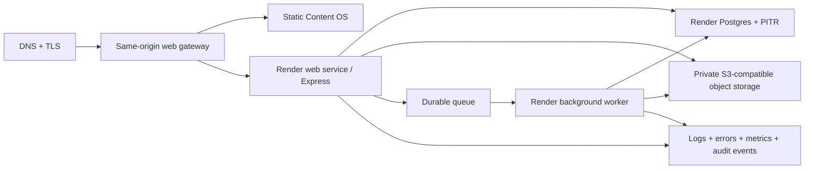

# Content Machine Production Closeout Plan

**Status:** Proposed; implementation not yet authorized

**Source audit:** `docs/audits/POST_RECOVERY_PRODUCTION_READINESS.md`

**Current decision:** Production NO-GO

**Planning baseline:** `6eeead8ec49a04eb788597b75c1e6f326339608e`

## Objective and guardrails

This plan turns the recovered Stage 0 baseline into a sequenced production-closeout program. It does not itself authorize code changes, infrastructure purchases, deployment, data migration, or launch. Each work package requires its stated decision gate and must use synthetic/non-production data until the launch gate.

Non-negotiable guardrails:

- preserve `main` and use dedicated branches and reviewed pull requests;
- never use production/customer credentials or data in development or preview;
- do not weaken validation, bypass failed security gates, or treat compilation as workflow acceptance;
- keep the alternate root frontend and Mockup Sandbox until an explicit ownership decision authorizes any disposition;
- separate preview, staging, and production secrets, data, domains, and provider budgets;
- require reversible migrations, backup evidence, rollback ownership, and audit artifacts for every release.

## Recommended target architecture

The planning target is Render for the Node API/worker and managed PostgreSQL, plus private S3-compatible object storage. A same-origin gateway should serve or route the frontend and `/api`. Long-running generation/export/scheduler work moves to a durable queue and worker. The architecture decision record must be approved before infrastructure implementation.



## Ordered work packages

Effort is a planning range for one experienced cross-functional team and excludes procurement/security-review lead time. “Recommended tool” describes the execution surface, not an authorization.

### WP0 — Product, data, and launch decisions

- **Priority:** P1 / first gate.
- **Scope:** approve target users/tenants, roles, identity provider, data classification, retention/deletion, citation style, media/video scope, AI providers/budgets, accessibility target, target regions, availability/RTO/RPO, and platform budget.
- **Likely affected:** architecture decision records, product requirements, threat model, data map, vendor/security reviews; no product code.
- **Dependencies:** none.
- **Acceptance criteria:** named approvers sign one non-contradictory decision record; every P1 has an accountable owner and target release.
- **Required tests/evidence:** tabletop user/tenant authorization scenarios; data-flow review; vendor control review; cost model.
- **Human decision gate:** product owner, security/privacy, engineering owner, operations/finance.
- **Recommended execution tool:** Codex for evidence consolidation and ADR drafting; issue tracker for ownership; human design/security review for approval.
- **Risk controls:** no infrastructure purchase, code change, or product-scope deletion before signed decisions; time-box unresolved decisions and record dissent/assumptions.
- **Effort:** 2–5 working days plus vendor review.

### WP1 — Canonical tree and contract rationalization

- **Priority:** P1 / foundation.
- **Scope:** confirm the pnpm canonical application, decide the root alternate frontend’s disposition, remove dead auth/client ambiguity only if separately authorized, and define API/client compatibility/versioning.
- **Likely affected:** root workspace/package files, `artifacts/content-os`, `lib/api-*`, root `src`, ownership/governance docs.
- **Dependencies:** WP0 product ownership decisions.
- **Acceptance criteria:** one build graph and one auth client are authoritative; alternate/mockup trees are explicitly labeled or archived under approved authority; generated contract drift is CI-detectable.
- **Required tests:** frozen install, typecheck, all current tests/builds, contract generation/diff check.
- **Human decision gate:** repository owner approves any tree removal or archival.
- **Recommended execution tool:** Codex for dependency/inventory refactor; GitHub review for destructive/disposition decisions.
- **Risk controls:** preserve alternate/mockup trees until explicit approval; require reproducible build and contract-drift checks before any disposition.
- **Effort:** 2–4 days.

### WP2 — Identity, tenancy, RBAC, and session security

- **Priority:** P1 / release blocker.
- **Scope:** replace shared-password identity with approved authentication; model organizations/tenants, membership, roles, admin step-up, session lifecycle, account recovery, and security audit events.
- **Likely affected:** `lib/db` schema/migrations, auth middleware/routes, every ownership query, frontend auth/settings/admin UI, API spec/client, tests.
- **Dependencies:** WP0 identity/tenant decisions; WP1 canonical contract.
- **Acceptance criteria:** distinct users and tenants; least-privilege roles; default-deny resource authorization; secure rotation/revocation; no shared admin secret; documented session/cookie/CSRF policy.
- **Required tests:** positive/negative RBAC matrix, cross-tenant BOLA tests, session fixation/revocation/expiry, CSRF/origin, rate-limit, migration and rollback, browser login/logout/recovery.
- **Human decision gate:** security review and privacy/data-controller approval.
- **Recommended execution tool:** Codex for implementation/test generation; approved identity-provider tooling; security reviewer for threat-model sign-off.
- **Risk controls:** expand-contract migrations; default-deny authorization; synthetic tenants only until negative tests and rollback rehearsal pass.
- **Effort:** 2–4 weeks.

### WP3 — Authorization defect and input-security remediation

- **Priority:** P1 / release blocker.
- **Scope:** fix revision/section and quality-issue/evaluation association checks; harden URL ingestion against SSRF; strengthen PDF/file validation; document public/private object policy; add mutation CSRF protection.
- **Likely affected:** API source, document, quality, storage and auth routes/services; schemas; tests.
- **Dependencies:** WP2 authorization primitives; WP0 data classification.
- **Acceptance criteria:** cross-resource/tenant identifiers always fail closed; private/link-local/metadata destinations and unsafe redirects are rejected; uploads are typed, bounded, scanned/quarantined per policy; mutations have explicit CSRF defense.
- **Required tests:** BOLA matrix, DNS rebinding/redirect/private CIDR fixtures without external scanning, malformed/polyglot/oversize file fixtures, CSRF tests, fuzz/property tests for validators.
- **Human decision gate:** application-security approval.
- **Recommended execution tool:** Codex for bounded remediation; static analysis/SCA tools; security reviewer for abuse-case validation.
- **Risk controls:** non-intrusive fixtures only; fail closed; no live-network scanning; preserve request size/time caps during tests.
- **Effort:** 1–2 weeks.

### WP4 — Platform-neutral routing, configuration, and environments

- **Priority:** P1 / release blocker.
- **Scope:** implement same-origin web/API routing or an environment-aware API client; externalize CORS/cookie/domain config; create preview/staging/prod environment contracts; define secret rotation and provider budgets.
- **Likely affected:** frontend client configuration, API `app.ts`, deploy manifests/blueprint, environment schemas/examples, CI, runbooks.
- **Dependencies:** WP0 architecture/region/budget approval; WP1 contract.
- **Acceptance criteria:** fresh preview and staging environments boot from documented config; login and every navigation route work without Replit; CORS/cookies are exact-domain and TLS-safe; missing/invalid config fails fast without leaking values.
- **Required tests:** config schema tests, cross-origin and same-origin browser tests, preview smoke, cookie/session tests, secret-redaction tests.
- **Human decision gate:** platform procurement, domain/DNS owner, security approval for secrets and origins.
- **Recommended execution tool:** Codex for config/manifests; Render infrastructure/dashboard or infrastructure-as-code; DNS provider tooling.
- **Risk controls:** preview first; exact origin allowlists; secrets never committed; production DNS/credentials require action-time human approval.
- **Effort:** 1–2 weeks.

### WP5 — Durable object storage and asset model

- **Priority:** P1 / release blocker.
- **Scope:** replace Replit sidecar signing with a private S3-compatible adapter; create asset metadata/ownership/status; migrate PDFs and future exports/media; implement lifecycle, reconciliation, and signed delivery.
- **Likely affected:** object-storage service, source/upload/download routes, `lib/db` assets schema/migrations, API spec/client, object-store infrastructure, cleanup jobs.
- **Dependencies:** WP0 retention/classification; WP2 tenancy; WP3 upload security; WP4 environment platform.
- **Acceptance criteria:** objects default private; every object is tenant/owner-associated; signed URLs are short-lived and scoped; orphan reconciliation and deletion/retention work; no web-service local disk is authoritative.
- **Required tests:** cross-tenant download denial, upload/type/size checks, expired signatures, object-not-found/retry, lifecycle/reconciliation, migration rehearsal and restore.
- **Human decision gate:** storage vendor, data residency, retention, and cost approval.
- **Recommended execution tool:** Codex for adapter/model; object-storage provider tooling; security review for bucket/IAM policy.
- **Risk controls:** private-by-default buckets; versioning; dual-read/rehearsed migration; orphan reconciliation; no destructive source deletion before verified copy.
- **Effort:** 2–3 weeks.

### WP6 — Durable queue, workers, and job correctness

- **Priority:** P1 / release blocker.
- **Scope:** move export, long generation, publishing, webhook, and performance work out of request-detached/in-process timers into durable jobs; add idempotency, retries, dead letters, cancellation, concurrency, and graceful shutdown.
- **Likely affected:** API orchestration/export/scheduler services, new worker package/service, DB job state or queue, Render worker/Key Value configuration, UI progress/retry.
- **Dependencies:** WP4 environments; WP5 object storage; WP2 identity/quotas.
- **Acceptance criteria:** acknowledged jobs survive API/worker restarts; one logical job produces one result; poison jobs dead-letter with actionable telemetry; replicas do not duplicate scheduled work; users can see/retry/cancel according to policy.
- **Required tests:** restart/kill tests, duplicate delivery/idempotency, retry/backoff/dead-letter, concurrency/locking, provider timeout, partial failure/resume, load baseline.
- **Human decision gate:** operations approval of queue/worker cost and retry semantics.
- **Recommended execution tool:** Codex for worker extraction; Render worker/queue tooling; load/chaos test runner.
- **Risk controls:** stable idempotency keys, fencing, bounded retries/cost, dead letters, graceful shutdown, and kill/restart testing before scale-out.
- **Effort:** 2–4 weeks.

### WP7 — Editorial integrity: editor, revisions, quality, claims, citations

- **Priority:** P1 / release blocker.
- **Scope:** make full-document changes persist with conflict-safe saves; expose revisions; enforce readiness before export; define approved-source/quality/claim gates; add inline citation/bibliography provenance and rendering.
- **Likely affected:** `ProjectDetail.tsx`, document/section/revision/quality/claim routes and DB schema, exporters, preview, generated clients, tests.
- **Dependencies:** WP0 citation/editor decisions; WP2 authorization; WP6 durable generation; WP5 durable artifacts.
- **Acceptance criteria:** long documents save/reload without loss; concurrent edits are detected; revision restore is authorized; claims link to approved source evidence; required quality failures block export; citations survive edit, preview, DOCX, and PDF.
- **Required tests:** browser authoring/reload/concurrency, revision/restore, readiness bypass attempts, citation round-trip and binary inspection, accessibility/keyboard editor tests.
- **Human decision gate:** editorial/product acceptance of citation style, quality thresholds, and export gate.
- **Recommended execution tool:** Codex for implementation; document-render inspection tooling; browser automation for acceptance.
- **Risk controls:** backward-compatible document migrations, autosave conflict protection, immutable provenance, and server-side export gates that cannot be bypassed by UI.
- **Effort:** 3–5 weeks.

### WP8 — Images and video

- **Priority:** P1 / intended-product blocker.
- **Scope:** implement image upload/library/placement/alt text/captions/crop/ordering, preview and DOCX/PDF export; implement approved safe video embed model and fallback export representation.
- **Likely affected:** asset DB/API, editor and preview, sanitization/CSP, storage/CDN, exporters, accessibility, tests.
- **Dependencies:** WP0 media policy; WP3 file security; WP5 assets; WP7 editor/export model.
- **Acceptance criteria:** authorized media survives upload, placement, save, reload, revision, preview, DOCX/PDF export, and deletion; images have required alt/caption policy; video providers/URLs are allowlisted and safely rendered.
- **Required tests:** malicious metadata/content fixtures, cross-tenant access, broken/deleted asset behavior, responsive rendering, binary DOCX/PDF inspection, CSP/embed tests, screen-reader semantics.
- **Human decision gate:** legal/licensing, content safety, accessibility, and product scope approval.
- **Recommended execution tool:** Codex for product implementation; image/document fixtures; browser and binary-render verification.
- **Risk controls:** allowlisted formats/providers, private assets, malware/content validation, CSP/sanitization, licensing records, and bounded processing.
- **Effort:** 3–6 weeks.

### WP9 — Responsive UX, accessibility, and workflow resilience

- **Priority:** P1 for full E2E/mobile; P2 for polish.
- **Scope:** mobile navigation/editor, desktop layout polish, consistent loading/error/empty/partial-failure states, quick-draft resume, keyboard/focus behavior, WCAG conformance.
- **Likely affected:** Content OS layout/pages/components/styles and browser tests.
- **Dependencies:** WP7/WP8 stable workflow/UI; WP0 accessibility target.
- **Acceptance criteria:** approved device matrix has no blocking overflow; all workflows are keyboard operable; focus/errors/status are announced; partial failures are recoverable; target automated and manual WCAG checks pass.
- **Required tests:** responsive screenshots at approved breakpoints, axe, keyboard-only/screen-reader manual scripts, slow/offline/error injection, quick-draft resume.
- **Human decision gate:** design and accessibility acceptance.
- **Recommended execution tool:** Codex for UI implementation; browser automation and accessibility scanner; human assistive-technology review.
- **Risk controls:** preserve keyboard paths and focus state in every change; use approved viewport/AT matrix; no snapshot-only accessibility acceptance.
- **Effort:** 2–4 weeks.

### WP10 — Observability, security supply chain, and operations

- **Priority:** P1 / release blocker.
- **Scope:** centralized redacted logs, metrics/traces/errors, audit events, SLOs/alerts, dashboards, incident/runbooks; pinned Actions, approved dependency/secret/code scans, SBOM/license policy, key rotation.
- **Likely affected:** API/worker instrumentation, CI workflows, dependency automation, operations/security docs, vendor integrations.
- **Dependencies:** WP0 compliance/SLO decisions; WP2 identity events; WP4 environments; WP6 workers.
- **Acceptance criteria:** actionable telemetry across request/job/document lifecycle; sensitive values demonstrably redacted; alerts have owners; approved SCA has no unresolved release-blocking findings; actions are pinned; SBOM and provenance are retained.
- **Required tests:** telemetry correlation, alert drills, redaction fixtures, dependency/secret/code scans, compromised/expired secret drill, incident tabletop.
- **Human decision gate:** security and operations acceptance; explicit approval before transmitting dependency metadata to advisory services.
- **Recommended execution tool:** Codex for instrumentation/CI; approved SCA/secret/code-scanning products; observability platform.
- **Risk controls:** redact before export, restrict audit access, cap telemetry cost, pin actions, and obtain approval before transmitting dependency metadata.
- **Effort:** 2–3 weeks.

### WP11 — CI/CD, backups, preview/staging, rollback, and release rehearsal

- **Priority:** P1 / release gate.
- **Scope:** protected CI gates, reproducible builds, preview environments, staging promotion, migration pre-deploy, DB/object backups, restore drill, canary/blue-green rollout decision, automated smoke and rollback.
- **Likely affected:** GitHub workflows, Render services/blueprint, object-store/database policies, release and recovery runbooks.
- **Dependencies:** WP2–WP10 complete enough for release candidate.
- **Acceptance criteria:** one commit is traceable from build to staging to production candidate; preview is isolated; PITR/logical/object restore is proven; rollback or forward-fix is timed and owned; failed gates prevent promotion.
- **Required tests:** complete local CI, browser E2E, binary export, security scans, migration forward/back compatibility, restore, load, worker kill/recovery, staging smoke, rollback rehearsal.
- **Human decision gate:** change advisory/engineering/security/operations sign-off before any production change.
- **Recommended execution tool:** GitHub Actions, Render deployment tooling/IaC, Codex for workflows/runbooks, approved browser/load/security runners.
- **Risk controls:** immutable artifacts, protected environments, backup before migration, expand-contract compatibility, isolated restore, and rehearsed rollback trigger.
- **Effort:** 2–4 weeks.

### WP12 — Final production verification and controlled launch

- **Priority:** Final sequential gate.
- **Scope:** execute the final gate, create production resources/secrets/domains under approval, run canary/controlled rollout, verify, observe, and either approve or roll back.
- **Likely affected:** production infrastructure and release records only after explicit authorization.
- **Dependencies:** all prior acceptance criteria; all P1 closed; launch checklist approved.
- **Acceptance criteria:** every final gate below passes with attached evidence; named launch authority issues GO; post-launch verification stays within SLO/error budget.
- **Required tests:** production-safe health/auth/core workflow, private storage, queued generation/export, DOCX/PDF with citation/media, audit event, backup status, alert delivery; no destructive test data.
- **Human decision gate:** explicit launch GO and action-time approval for production mutation.
- **Recommended execution tool:** approved deployment/IaC tooling and GitHub release workflow; human incident commander; Codex only for evidence/status support.
- **Risk controls:** canary/blue-green promotion, named incident/rollback owners, production-safe synthetic checks only, stop-the-line authority, and observation window.
- **Effort:** 2–5 days plus observation window.

## Traceability to audit findings and product requirements

| Closeout package | P1 findings resolved | Missing/partial requirement coverage |
|---|---|---|
| WP0–WP1 | Governs all; tree ambiguity supporting P1-14/P1-16 | Defines acceptance for every content type and resolves canonical ownership |
| WP2 | P1-01 | Authentication, roles/admin, brand/project authorization |
| WP3 | P1-03, P1-08, P1-09 | Sources, revisions, quality/claims security |
| WP4 | P1-02 | Authentication/navigation/browser journey, preview/staging topology |
| WP5 | P1-04, P1-05 storage portion | Saved persistence, source PDFs, image assets, durable exports |
| WP6 | P1-05 job portion, P1-06 | Drafting, generation, export progress/error/retry |
| WP7 | P1-07, P1-10, P1-11 | Full-document editing, revisions, quality, claims, citations, preview, DOCX/PDF fidelity |
| WP8 | P1-12 | Image upload/placement/captions/export and video embedding |
| WP9 | P1-16 UX portion | Navigation, status, errors/loading/empty states, mobile, desktop, accessibility |
| WP10 | P1-13, P1-15, P1-16 security evidence | Operational evidence and secure workflow acceptance |
| WP11 | P1-14, P1-16 CI portion | Complete end-to-end UI, persistence, export, restore, rollback |
| WP12 | Final verification of all P1s | Final acceptance of all 36 product requirements |

Every P1 is assigned above. Every MISSING requirement is covered by WP7–WP9; every PARTIAL requirement is closed through its functional package plus WP9–WP11 acceptance. No intended product requirement is silently deferred out of production scope.

## Parallel and sequential execution

After WP0 and WP1 establish decisions/contracts:

- WP2 and the non-auth portions of WP4 can run in parallel with tight API-origin/session coordination.
- WP3 threat-model/test design can start alongside WP2, but authorization fixes land after the identity primitives stabilize.
- WP5 storage foundations and WP6 queue design can run in parallel after environment contracts; final worker jobs depend on object storage.
- WP7 editor/citation data design can begin alongside WP5/WP6, but export acceptance waits for both.
- WP8 depends on the WP5 asset model and WP7 document model; it must remain sequential behind them.
- WP9 can start with shell/navigation/accessibility foundations, but workflow acceptance waits for WP7/WP8.
- WP10 instrumentation and CI security can run incrementally across all packages; its release acceptance waits for stable services.
- WP11 and WP12 are sequential release gates and cannot overlap unfinished P1 work.

Critical sequence:

```text
WP0 → WP1 → WP2 → WP3
            ↘ WP4 → WP5 → WP6 → WP7 → WP8 → WP9
                       ↘ WP10 ───────────────↗
                                      WP11 → WP12
```

Indicative elapsed duration with responsible parallelism is **12–20 weeks** for one cross-functional team. This is not a commitment and should be re-estimated after WP0.

## Deployment-readiness checklist

- [ ] All P1 issues in the production-readiness audit are closed with evidence.
- [ ] P2 security/data findings are closed or risk-accepted by named authorities with expiry dates.
- [ ] Canonical tree and API contract are unambiguous.
- [ ] Identity, tenant, RBAC, admin, session, and CSRF controls pass the negative matrix.
- [ ] SSRF, upload, storage, and download controls pass security review.
- [ ] Frontend/API work under approved domains without Replit dependencies.
- [ ] Postgres, object storage, queue, worker, and migration topology is provisioned in staging.
- [ ] No authoritative artifacts depend on local web-service disk.
- [ ] Full document editing, revisions, readiness, claims, citations, images, video, preview, DOCX, and PDF pass browser acceptance.
- [ ] Mobile, desktop, keyboard, screen-reader, loading, error, empty, and partial-failure acceptance pass.
- [ ] Real approved AI providers pass sandbox tests with quotas, cost caps, and failure injection.
- [ ] Frozen install, typecheck, API, frontend, integration, E2E, accessibility, build, security scans, and binary inspections are green with zero hidden skips.
- [ ] Actions are pinned; SBOM/provenance/license and dependency dispositions are retained.
- [ ] Logs, metrics, traces, errors, audit events, dashboards, alerts, and runbooks are live in staging.
- [ ] RTO/RPO are approved; database/object backup and restore drill passes.
- [ ] Preview/staging/prod environments and secrets are isolated.
- [ ] Migration compatibility, rollout, and rollback rehearsal pass.
- [ ] DNS/TLS/CORS/cookies/CSP/security headers are approved.
- [ ] Capacity/cost tests fit the approved budget and SLO.
- [ ] Product, editorial, accessibility, security, operations, privacy, and engineering owners sign the release candidate.

## Launch checklist

Before the change window:

- [ ] Freeze and identify the exact release commit, artifacts, SBOM, migrations, and configuration digest.
- [ ] Confirm current backups/PITR/object versioning and a recent restore rehearsal.
- [ ] Confirm incident commander, deployment operator, observers, rollback owner, communications channel, and decision times.
- [ ] Validate provider/storage/database quotas and spending/usage alerts.
- [ ] Lower DNS TTL only if the approved rollout requires it; verify certificates and redirects.
- [ ] Confirm no test/demo credentials or cross-environment URLs are in production configuration.
- [ ] Re-run all release gates against the immutable candidate.

During controlled rollout:

- [ ] Execute migration pre-deploy and record output; stop on any discrepancy.
- [ ] Deploy canary/blue-green target per approved strategy; do not expose all traffic immediately.
- [ ] Verify health, login/session, tenant isolation, core authoring, source ingest, queue processing, preview, DOCX/PDF, media/citations, downloads, and audit events with production-safe synthetic records.
- [ ] Observe latency, error, job retry/dead-letter, database, object-store, provider cost, and security signals for the agreed window.
- [ ] Obtain explicit GO before increasing traffic.

After rollout:

- [ ] Verify scheduled jobs exactly once, backups current, alerts armed, and no cross-environment traffic.
- [ ] Remove synthetic production verification records through approved application flows.
- [ ] Publish release evidence, known risks, ownership, and next review date.

## Rollback checklist

- [ ] Declare the rollback trigger, decision owner, and maximum decision time before launch.
- [ ] Stop traffic promotion and disable/cancel new high-cost jobs safely.
- [ ] Route traffic to the last known-good immutable release.
- [ ] Prefer backward-compatible/expand-contract migrations; never destructively reverse a database without a verified plan.
- [ ] If data recovery is required, restore to an isolated database/object namespace first, validate, then switch connections under approval.
- [ ] Preserve logs, queue state, audit events, deployment IDs, and failing artifacts for incident analysis.
- [ ] Verify session behavior, queue idempotency, object compatibility, and last-known-good smoke tests after rollback.
- [ ] Communicate status and do not retry launch until the incident owner approves a corrected candidate.

## Final production verification gate

The final verdict is binary.

**GO** requires all of the following:

1. every P1 is closed;
2. all required automated suites pass with zero failed and zero hidden/accepted skips;
3. an independent browser run completes the entire required product journey on desktop and mobile without manual API calls;
4. identity/tenant negative tests, approved SCA, secret/code scans, and application-security review pass;
5. migration, backup restore, worker restart, and rollback rehearsals pass in staging;
6. production architecture, vendor spend, data policy, and launch risk are approved by named humans;
7. the exact immutable release candidate is the one verified and promoted.

Any unmet condition yields **NO-GO**. A green build alone can never satisfy this gate.
